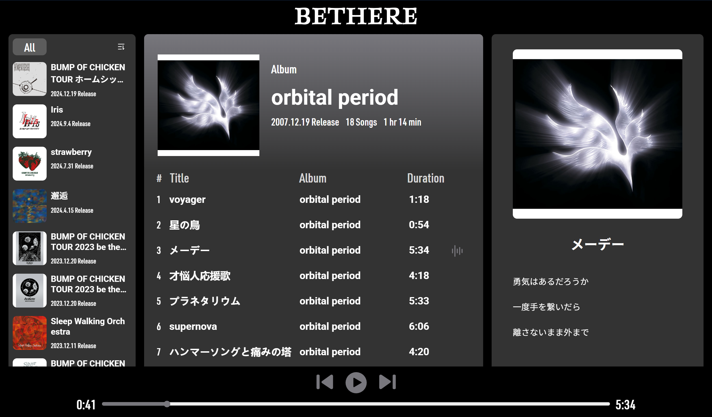
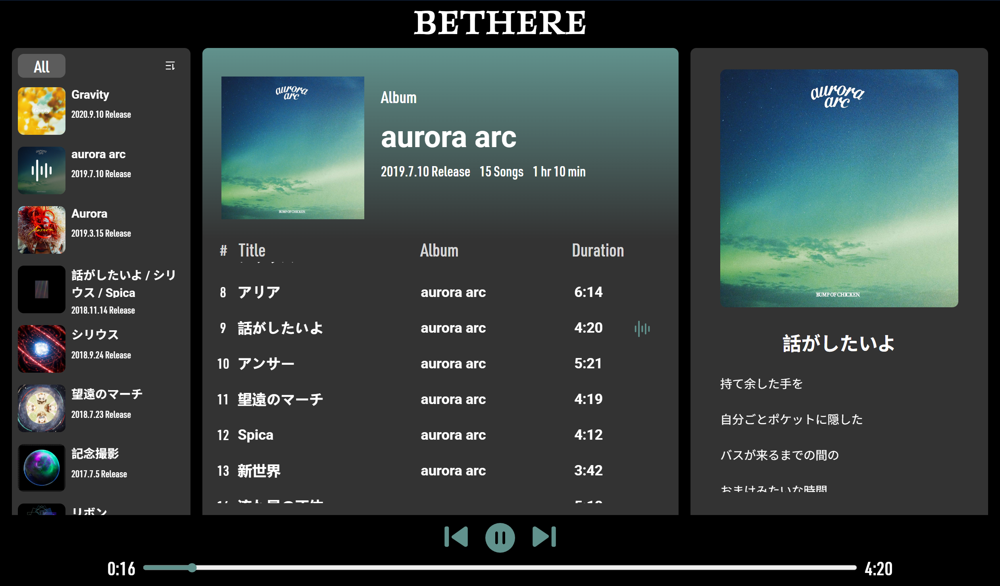

# bethere

## 项目简介
因为太过喜欢BUMP OF CHICKEN所以做了一个音乐播放器，功能是只能听BOC的歌...

做着玩的项目，没有任何实际用处...

ui设计和profile页面参考了[BOC官网](https://www.bumpofchicken.com)






## 使用的 API
本项目依赖 [NeteaseCloudMusicApi](https://github.com/Binaryify/NeteaseCloudMusicApi) 或兼容的本地音乐 API 服务，默认请求地址为 `http://localhost:3000`。

主要用到的接口有：
- `GET /artist/album?id=ARTIST_ID`：获取指定歌手的专辑列表
- `GET /album?id=ALBUM_ID`：获取专辑详情及歌曲列表
- `GET /song/detail?ids=SONG_ID`：获取歌曲详细信息
- `GET /song/url?id=SONG_ID`：获取歌曲播放地址
- `GET /lyric?id=SONG_ID`：获取歌词

> ⚠️ 需先启动本地音乐 API 服务，否则无法正常获取数据。

## 主要功能
- 专辑列表浏览与筛选（全部/专辑/单曲）
- 专辑详情与歌曲列表展示
- 歌曲播放、暂停、切换、进度条拖动
- 歌词实时显示
- 歌手/乐队成员信息与社交链接展示
- 响应式布局与主题色自适应

## 安装与启动
1. 安装依赖：
   ```bash
   npm install
   ```
2. 启动开发服务器（需先启动本地音乐 API 服务）：
   ```bash
   npm run serve
   ```
   默认访问地址：http://localhost:8080
3. 构建生产环境：
   ```bash
   npm run build
   ```

## 依赖环境
- Node.js >= 14
- npm >= 6
- 本地音乐 API 服务（如 NeteaseCloudMusicApi，端口需为 3000(默认) 或自行修改源码）